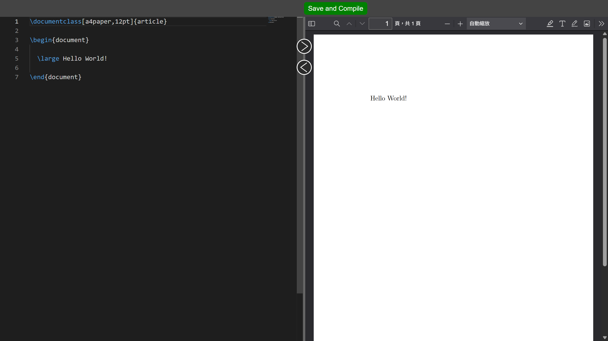

# Remote-LaTeX-Editor
A simple remote latex online editor.



## Getting Started

Make sure you have already installed the Python 
environment. (Python 3.10+ recommended)

Also, your device needs a latex environment. ( at least
the command `xelatex` should be available)

1. Clone the repo.
```bash
$ git clone https://github.com/D101028/Remote-LaTeX-Editor.git
$ cd Remote-LaTeX-Editor
```

2. Create and activate the virtual environment.
```bash
$ python3 -m venv .venv

# Windows
$ .venv/Scripts/activate
# Linux/MacOS
$ source .venv/bin/activate
```

3. Install the required packages. 
```bash
$ pip3 install -r requirements.txt
```

4. Create the config file. 

You may edit and use the template config file `./config.conf`, 
or just use your own config file. 

5. Start the app.
```bash
$ python3 main.py                       # Use the default config file `./config.conf` 
$ python3 main.py -c your_config.conf   # Use your own config file
```

## Third-Party Libraries Notice

This project uses [PDF.js](https://github.com/mozilla/pdf.js). Its source code and viewer interface are licensed under the [Apache License 2.0](https://www.apache.org/licenses/LICENSE-2.0). The original license file can be found at `app/static/pdfjs/LICENSE`.
